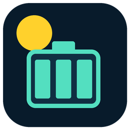
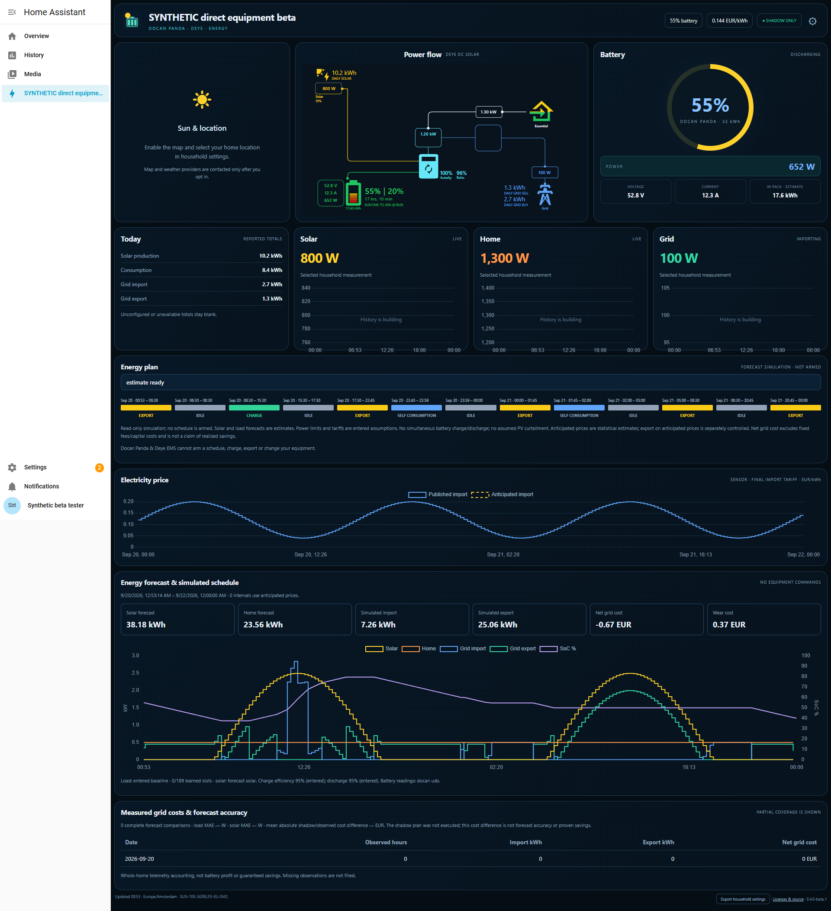

# Docan Panda & Deye EMS

Understand your battery, forecast tomorrow's energy needs, and compare a simulated
charging/export plan against your electricity tariff — in one Home Assistant
integration with an automatically created dashboard.

**Experimental beta 0.4.0-beta.1. Read-only: this integration never operates the
battery or inverter.** Export arbitrage and charging are simulations. No schedule
is armed, no plant services are registered, and no controls are created.

Designed for the **Docan Panda 32 kWh** and **Deye SUN-10K-SG05LP3-EU-SM2**.
The 6, 8 and 12 kW SG05LP3 variants are selectable profiles. These profiles have
passed simulated protocol tests; physical hardware/firmware compatibility has
not been verified for this beta.

## What it does

| Feature | What you get |
|---|---|
| Equipment connection | Built-in Deye telemetry over Solarman V5, Modbus TCP or RTU-over-TCP; optional independent Docan USB/RS485 readings |
| Energy dashboard | Battery, power flow, optional sun/location map, solar, home, grid, price chart, simulated schedule and history |
| Solar forecast | Built-in Forecast.Solar for one panel orientation, or an aggregated forecast sensor for multiple orientations |
| Household load forecast | Starts with your entered average load; learns a local time-of-day profile from sufficiently complete observed days |
| Import/export optimization | Simulates charging, self-consumption and optional battery export using solar, load, tariffs, losses, reserve, power limits and battery wear cost |
| Price anticipation | Optional historical estimate of unpublished tomorrow prices, clearly labelled and drawn with a dashed line |
| Efficiency learning | Optional measured charge/discharge efficiency when a dedicated battery AC power measurement is available alongside DC power |
| Performance reporting | Observed whole-home grid costs with coverage, solar/load forecast errors and explicitly labelled simulated-versus-observed cost difference |
| Recovery | Private settings export/import and stable installation identity; normal HA backups preserve the full configuration |

It is an observation and planning tool, not an autonomous equipment controller.
It does not provide battery protection, commissioning or guaranteed savings.

*Disposable HA demonstration using synthetic measurements, prices and forecasts.
This is not a live household screenshot.*

## Hardware and information needed

1. A commissioned Docan Panda 32 kWh battery and the selected Deye inverter, with
   their **working battery-to-inverter BMS communication cable** in place. The
   correct BMS port/protocol depends on the manufacturer's instructions for the
   exact revision. A connector shape alone does not identify CAN versus RS485.
2. For **independent Docan readings**, an **RS485-to-USB cable/adapter between the
   battery's telemetry interface and the HA host is required**. This is a separate
   connection from the battery-to-inverter BMS cable. Enter the USB serial path
   and configured battery address. The supported reader uses 9600 baud, 8N1 and
   one fixed telemetry query. Alternatively choose inverter/existing readings.
3. A compatible Deye network logger/gateway: local IP, port and Modbus unit, plus
   logger serial for Solarman V5. A separate equipment integration is not needed
   for the supported direct setup. Existing HA sensor mappings remain available.
4. Your solar connection type and total installed **kWp**. Deye DC MPPTs are read
   automatically. External AC/mixed solar needs a combined production sensor
   supplied by that equipment's integration.
5. A price source: **Tibber token and home**, **Nord Pool area plus household taxes
   and fees**, or a compatible price sensor. Export compensation is entered
   separately; import price is never treated as export revenue.
6. For forecasting: panel tilt/azimuth and consent to send coordinates to
   Forecast.Solar, or a suitable forecast sensor; average home load for cold start;
   reserve, targets, limits, efficiency assumptions and wear cost.
7. Optionally, your home address label and selected coordinates for the sun map.
   No address or coordinates from another household are included.

See [equipment connections](EQUIPMENT_CONNECTION.md) and
[forecast/planning details](PLANNING.md) for the exact supported boundaries.

## Installation

**This candidate is staged, not yet published.** These HACS steps become usable
after the repository and beta release are published. It is not a default-store
HACS listing. Home Assistant 2026.5.3 or later is declared; actual lab testing used
2026.6.1.

1. Back up Home Assistant and configure HACS.
2. Open **HACS → menu → Custom repositories**.
3. Add `https://github.com/Xaiamasters/ha-docanpanda32kwh-deyeSG05LP3-ems` with
   category **Integration**.
4. Open **Docan Panda & Deye EMS**, enable beta versions if necessary, and download
   `0.4.0-beta.1`.
5. Restart HA. Open **Settings → Devices & services → Add integration →
   Docan Panda & Deye EMS**.
6. Complete the wizard: hardware → battery source/readings check → inverter
   connection/readings check → optional home location → solar → import tariff →
   export tariff → planning mode → forecast and optimization assumptions.
7. Open the automatically added dashboard in the sidebar.

No separate dashboard cards need installing. Their licensed runtime assets,
notices and source are bundled. HA installs the declared Python dependencies.
For manual installation, copy only `custom_components/docan_deye_ems` into
`config/custom_components/`, restart HA, and continue at step 5.

Use **Reconfigure** to change configuration. Do not run a second poller against an
exclusive USB device or a single-client gateway; use existing HA sensors instead.

## Sensors and entities

Available measurements depend on the selected connection and optional mappings.
Names are prefixed with your installation name; identifiers are assigned by HA.

| Group | Entities / information |
|---|---|
| Battery | SoC, voltage, current, power; independent Docan mode also gives temperature and cell-voltage spread |
| Inverter and site | Inverter AC power, home load, grid power, solar power; reported daily solar/load/import/export totals where supported |
| Tariff and plan | Current import price, structured observed or shadow plan, readiness binary sensor |
| Forecast plan | Solar/load forecast energy, planned grid import/export, net grid cost, wear cost and projected end SoC |
| Learning and reporting | Active load model, charge/discharge efficiency used, solar/load mean absolute error, shadow/observed cost difference and observed daily statistics |

Battery power/current are positive when discharging; grid power is positive when
importing. Unknown or stale measurements remain unavailable. A missing required
input hides the plan and raises a Repairs warning. A failed independent battery
read never silently substitutes inverter-reported SoC.

Historical charts build from this HA instance's recorder. The learning store
builds locally from actual observations; a new installation has no invented
history. Forecast totals describe the remaining horizon, not a full-day meter.

## Privacy, backups and licences

All household values are entered during setup. The public package contains no
household address, live endpoint, credentials, learned history or private backup.
The public GitHub maintainer identity is intentionally present in metadata.

The map and solar forecast have separate opt-ins. Map providers receive selected
coordinates/browser requests when enabled; Forecast.Solar receives coordinates,
orientation and kWp when selected and consented. Turning off the map does not
turn off a separately enabled solar forecast. Tibber receives its token only for
its price API. Diagnostics omit credentials, location and connection identifiers.

**Export household settings** produces a private JSON file containing local
connection details, optional location, mappings and tariff. It excludes the
Tibber token and learned history. Keep this file private and re-enter the token
when restoring. A complete HA backup is needed to preserve credentials, learned
history and recorder data. Removing the integration deletes its learning store;
HA's recorder retains history according to its own retention policy.

Original integration code is MIT. Bundled components retain their own licences,
including GPL-3.0-or-later for Helios; source/notices are supplied. See
[third-party notices](THIRD_PARTY_NOTICES.md), [testing](TESTING.md),
[support](SUPPORT.md) and the [publication checklist](PUBLICATION_CHECKLIST.md).
